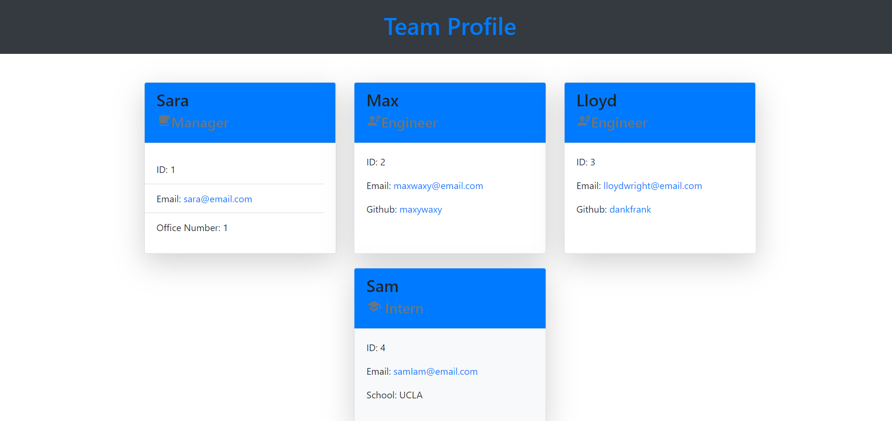

# Team-Profile-Generator

## Description
Team Profile Generator is a Node.js command-line application that takes in information about employees on a software engineering team and generates an HTML webpage that displays summaries for each person. The method used to build the app was based on the test driven development and object oriented programming paradigms. The app uses Jest for testing and inquirer for the command line interface. The bootstrap framework was used as well as google fonts and icons.

## Installation and usage
After downloading, ensure node, inquirer, and jest are installed as these are crucial dependencies. Then run node index from the command line. The html file will be generated in the dist folder and resemble the following:

For a video tutorial please [Click Here](https://drive.google.com/file/d/1dxAqTsVLGIceWeE611105FZycX8jbJp9/view)

## Built With
Node.js is the runtime environment. Using TDD and OOP as methodologies, the tests were built first using jest and the functionality of the app was written to pass the tests. Inquirer neatly packaged user input as objects to allow for the convenient and intuitive implementation of OOP. For styling of the html, bootstrap, google fonts, and material icons were implemented.
